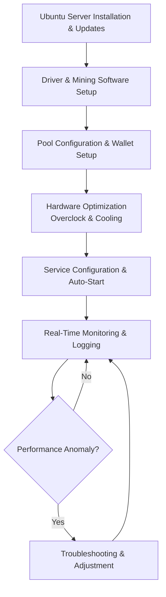

# Ubuntu Bitcoin Miner Setup

Ubuntu Bitcoin Miner Setup provides step-by-step instructions for configuring high-performance SHA-256 mining on Ubuntu with ASIC/GPU support, pool integration, overclocking, and monitoring for optimal hash rate and efficiency.

### Introduction to Bitcoin Mining on Ubuntu

Bitcoin uses the SHA-256 hashing algorithm, primarily mined with ASICs. An **Ubuntu Bitcoin Miner Setup** serves as a complete **operating system configuration and mining client deployment guide** optimized for stability, performance, and ease of management on Linux servers.

Miners and operators use Ubuntu for its reliability, security, and extensive tooling when running dedicated mining rigs or farms.

### Inside the System: Core Mechanism

The setup process establishes a **stable mining environment** with:

- Optimized Ubuntu server configuration for 24/7 operation
- ASIC/GPU driver and mining software installation
- Pool connection with efficient stratum protocol
- Hardware monitoring and overclocking tools
- Automated startup and logging systems

The configuration emphasizes thermal management, power efficiency, and remote monitoring for long-term operation.

### Target Audience and Practical Use Cases

This setup targets:
- Individual miners running dedicated rigs
- Small to medium mining farm operators
- Users transitioning from Windows to Linux for better stability
- Developers and enthusiasts building custom mining solutions

Common applications include:
- **Dedicated ASIC mining rigs** on Ubuntu servers
- **GPU mining experimentation** (though less competitive for BTC)
- **Headless remote mining farm management**
- **Educational and testing environments**

### Technical Architecture and Operational Logic

A typical Ubuntu Bitcoin Miner Setup includes:

- **Base System Optimization**: Minimal Ubuntu Server with necessary drivers
- **Mining Software**: CGMiner, BFGMiner, or Braiins OS components
- **Hardware Management**: Fan control, voltage, and frequency tuning
- **Monitoring Stack**: Prometheus/Grafana or simple scripts for hash rate tracking
- **Automation Layer**: Systemd services for reliable startup

**Operational Logic Flowchart**

### Key Features and Technical Advantages

- **Stability**: Ubuntu’s long-term support and reliability for 24/7 mining
- **Performance Tuning**: Fine-grained control over hardware parameters
- **Remote Management**: SSH and web-based monitoring options
- **Resource Efficiency**: Minimal OS overhead for maximum hash rate
- **Community Support**: Extensive documentation and troubleshooting resources

The setup provides a robust foundation for professional-grade Bitcoin mining operations.

### Where It Fits in the Market: Comparison Table

| Aspect                | Ubuntu Bitcoin Miner Setup | Windows Mining Rigs   | Cloud Mining          | Turnkey Mining OS    |
|-----------------------|----------------------------|-----------------------|-----------------------|----------------------|
| Control              | Full customization        | User-friendly         | Limited               | Good                 |
| Stability            | Excellent                 | Good                  | High                  | High                 |
| Performance Tuning   | Advanced                  | Moderate              | Managed               | Good                 |
| Cost Efficiency      | High                      | Moderate              | Subscription          | Moderate             |
| Best Use Case        | Dedicated rigs            | Beginner setups       | No hardware           | Easy deployment      |
| Technical Requirement| Moderate to high          | Low                   | Very low              | Low                  |

### Risk Surface and Limitations

Mining setups involve practical considerations:
- **Hardware Wear**: Continuous high-load operation reduces component lifespan
- **Electricity Costs**: Major factor in profitability calculations
- **Network Difficulty**: Increasing competition reduces individual rewards
- **Security**: Exposed mining servers require proper firewall and SSH hardening
- **Regulatory Uncertainty**: Mining regulations vary by jurisdiction

**Optimization Note**: Maintain proper cooling, monitor power consumption, use efficient PSUs, and calculate profitability regularly. Implement remote monitoring and automated alerts for temperature or hash rate drops.

### Deployment Profile and Getting Started

1. **Hardware Preparation**: Use compatible ASIC miners or GPUs with adequate cooling and power.
2. **Ubuntu Installation**: Install Ubuntu Server and perform initial updates.
3. **Mining Software Setup**: Install and configure preferred mining client.
4. **Pool & Wallet Configuration**: Connect to a reliable pool and set payout address.
5. **Optimization & Monitoring**: Tune settings and set up monitoring tools.

Detailed community guides and pool documentation provide step-by-step instructions.

### Conclusion

The Ubuntu Bitcoin Miner Setup offers a stable and highly customizable platform for efficient SHA-256 mining operations. Its value lies in reliability, performance tuning capabilities, and resource efficiency rather than any profitability guarantee. For users with appropriate hardware and realistic expectations regarding electricity costs and network difficulty, it provides a professional-grade solution for participating in Bitcoin mining.

### FAQ

**Is Bitcoin mining profitable on Ubuntu in 2026?**  
Profitability depends heavily on electricity costs, hardware efficiency, and Bitcoin price. Many operations focus on network contribution alongside potential rewards.

**What hardware works best with Ubuntu?**  
Modern ASIC miners are the most efficient for SHA-256. GPUs are less competitive but useful for testing or alternative algorithms.

**How do I secure my mining server?**  
Use firewall rules, key-based SSH, disable unnecessary services, and keep the system updated. Consider running in an isolated network.

**What are the main costs?**  
Electricity, hardware depreciation, and pool fees. Accurate calculation is essential before scaling operations.

**How does it compare to cloud mining?**  
Self-hosted mining on Ubuntu offers full control and potentially better economics, while cloud mining provides convenience without hardware management at higher effective costs.
